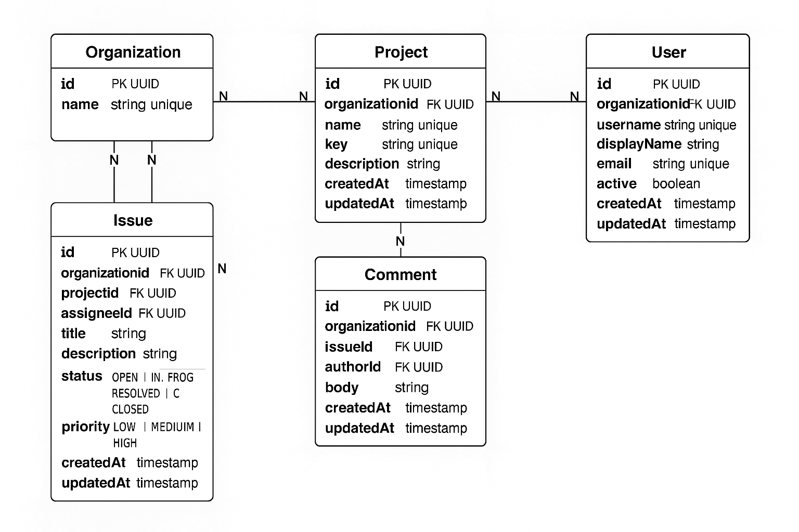

# ServiceDesk — Domain Model (Baseline, Updated)

## Purpose

Define the core entities, relationships, constraints, and invariants for the ServiceDesk backend. This document is the source of truth for later API and database design.

## Conventions

* Identifiers: UUID (string at API boundary).
* Timestamps: ISO-8601 in UTC (`createdAt`, `updatedAt`).
* Soft delete: not supported in v1.
* Text limits:

    * `name` ≤ 100 chars
    * `title` ≤ 140 chars
    * `description`/`comment` ≤ 10,000 chars

---

## Entities

### Organization

* `id` (UUID, required)
* `name` (string, 1–100, required, unique globally)
* `createdAt`, `updatedAt` (timestamps)

**Notes**

* Every other entity belongs to exactly one Organization (multi-tenant design).
* For now, `organizationId` is passed via header (e.g., `X-Org-Id`); in future it will come from JWT claims.

---

### User

* `id` (UUID, required)
* `username` (string, 3–50, required, unique per organization)
* `displayName` (string, 1–100, required)
* `email` (string, required, unique per organization, RFC-compliant)
* `active` (boolean, default `true`)
* `organizationId` (UUID, required → Organization.id)
* `createdAt`, `updatedAt` (timestamps)

**Notes**

* Passwords are stored as salted hashes, never returned in responses.
* Email is returned only to authenticated callers (future step).

---

### Project

* `id` (UUID, required)
* `name` (string, 1–100, required, unique per organization)
* `key` (string, 2–10, required, uppercase A–Z, unique per organization)
  *Example: `SD`*
* `description` (string, optional, ≤ 10000)
* `organizationId` (UUID, required → Organization.id)
* `createdAt`, `updatedAt` (timestamps)

**Invariants**

* `key` is immutable after creation in v1.
* Deleting a Project is allowed, but all its Issues are marked `CLOSED` as part of a transactional operation. Comments remain.

---

### Issue

* `id` (UUID, required)
* `projectId` (UUID, required → Project.id)
* `assigneeId` (UUID, optional → User.id)
* `title` (string, 1–140, required)
* `description` (string, optional, ≤ 10000)
* `status` (enum, required) → `OPEN | IN_PROGRESS | RESOLVED | CLOSED`
* `priority` (enum, required) → `LOW | MEDIUM | HIGH`
* `organizationId` (UUID, required → Organization.id)
* `createdAt`, `updatedAt` (timestamps)

**Invariants**

* `assigneeId` must reference an active User in the same Organization.
* `status` transitions must follow the table below.

**Status transitions (v1)**

| From         | To           | Notes                     |
| ------------ | ------------ | ------------------------- |
| OPEN         | IN\_PROGRESS | Allowed                   |
| OPEN         | RESOLVED     | Allowed                   |
| IN\_PROGRESS | RESOLVED     | Allowed                   |
| IN\_PROGRESS | OPEN         | Allowed (revert)          |
| RESOLVED     | CLOSED       | Allowed                   |
| RESOLVED     | IN\_PROGRESS | Allowed (reopen for work) |
| CLOSED       | (none)       | Terminal in v1            |

---

### Comment

* `id` (UUID, required)
* `issueId` (UUID, required → Issue.id)
* `authorId` (UUID, required → User.id)
* `body` (string, 1–10000, required)
* `organizationId` (UUID, required → Organization.id)
* `createdAt`, `updatedAt` (timestamps)

**Invariants**

* `authorId` must reference an active User in the same Organization.

---

## Relationships

* Organization 1—N Project
* Organization 1—N User
* Project 1—N Issue
* Issue 1—N Comment
* User 1—N Issue (as assignee)
* User 1—N Comment (as author)

---

## Indexing Plan (anticipating queries)

* `projects(organization_id, key)` unique
* `users(organization_id, username)` unique
* `users(organization_id, email)` unique
* `issues(organization_id, project_id, status, priority, created_at)`
* `issues(organization_id, assignee_id, status)`
* `issues(lower(title))` — supports case-insensitive `titleContains` search
* `comments(issue_id, created_at)`

---

## Validation Summary

* Strings trimmed; reject all-whitespace values.
* Enforce max lengths.
* Email validated against RFC; normalized to lowercase on write.
* UUIDs validated at the API boundary.
* Enforce status transition rules with 409 error on invalid transitions.

---

## Out of Scope (Deferred Features)

* Labels, attachments, watchers, audit trail.
* SLA timers / escalations.
* Role-based access control (handled in Auth step).
* Reopening of `CLOSED` issues.

---

## ERD diagram
